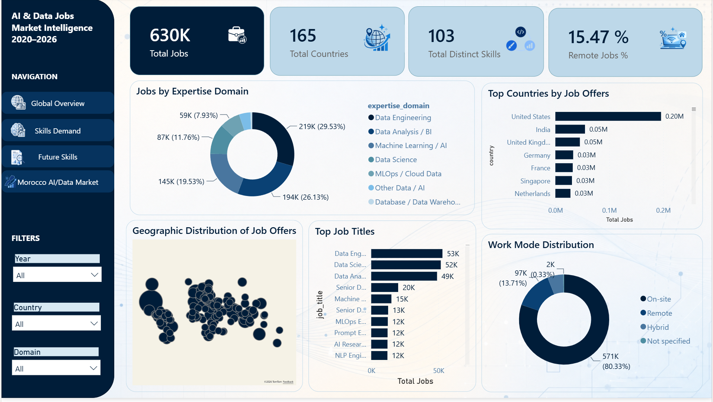
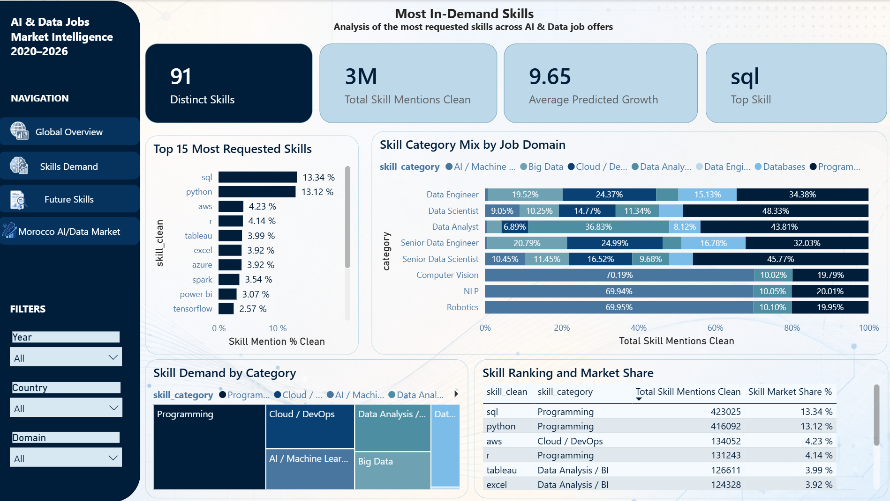
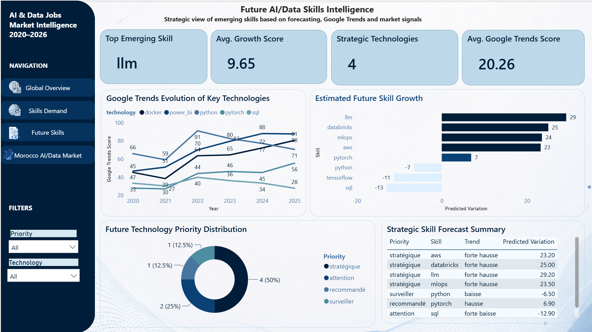
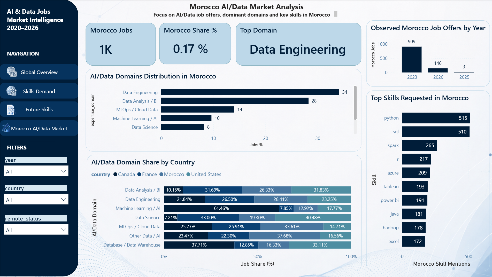

# AI & Data Job Market Intelligence

End-to-end **Web Mining, Data Engineering, NLP, Graph Analytics and Forecasting** project for analysing the evolution of Data & AI skills from large-scale job-market data.

The project builds a complete analytical pipeline from heterogeneous job-offer sources to data quality assessment, NoSQL storage, semantic skill enrichment, graph mining, trend forecasting and an interactive BI dashboard.

## Project overview

The objective is to answer a practical question:

> How can online job-market data be transformed into reliable intelligence about the skills, technologies and domains shaping Data Science and Artificial Intelligence careers?

The consolidated analytical dataset contains **751,801 Data & AI job offers** covering **2020-2026** and an international scope of **165 countries**. The pipeline then transforms these records into structured skill-level and trend-level datasets for downstream analysis.

## End-to-end architecture


## What this project demonstrates

- Large-scale multi-source data consolidation and standardization
- Data quality assessment before downstream modelling
- Semi-structured storage and analytical querying with MongoDB
- Skill extraction and enrichment from textual job descriptions
- TF-IDF, multi-label representations and sentence embeddings
- Automatic classification of Data & AI job domains
- Skill co-occurrence graph construction and network analysis
- Centrality analysis and Louvain community detection
- Time-series trend analysis using Google Trends data
- Forecasting with Prophet, ARIMA and linear regression
- Business-oriented visual storytelling through Power BI

## Pipeline notebooks

| Step | Notebook | Purpose |
|---|---|---|
| 01 | `01_collecte_et_sources.ipynb` | Source analysis, collection inventory and consolidated dataset validation |
| 02 | `02_cleaning_fusion_dataset.ipynb` | Cleaning, normalization, schema alignment and dataset fusion |
| 03 | `03_data_quality_framework_v2.ipynb` | Missing values, duplicates, temporal/geographic coverage and quality controls |
| 04 | `04_creation_dataset_skills_exploded.ipynb` | Transformation from job-level data to skill-level observations |
| 05 | `05_mongodb_storage.ipynb` | MongoDB collections, indexes and analytical queries |
| 06 | `06_web_content_mining_final_respecte.ipynb` | NLP, TF-IDF, embeddings, skill enrichment and domain classification |
| 07 | `07_web_structure_mining_graph_skills.ipynb` | Skill graphs, centrality, Louvain communities, Google Trends and forecasting |

## Key analytical results

The project highlights several important engineering and analytical observations:

- The consolidated dataset contains **751,801 job offers**.
- Skills are available for approximately **99.96%** of the consolidated records.
- The dataset spans **2020-2026** and **165 countries**.
- The pipeline models skill relationships through a weighted co-occurrence graph.
- Network analysis identifies central and transversal technologies across Data, AI, Cloud and Big Data ecosystems.
- Because the original job dataset is temporally imbalanced, forecasting is supported with a separate Google Trends time series rather than blindly extrapolating the job-count distribution.

## Dashboard

### Global overview



### Skills demand



### Future skills



### Morocco market



The Power BI source file will be added in a later commit. The dashboard screenshots already document the main analytical views.

## Technology stack

**Data Engineering:** Python, Pandas, NumPy  
**Storage:** MongoDB, PyMongo  
**NLP / Content Mining:** Scikit-learn, Transformers, Sentence Transformers  
**Graph Analytics:** NetworkX, python-louvain  
**Forecasting:** Prophet, ARIMA, Linear Regression, Pytrends  
**Visualization:** Matplotlib, Seaborn, Power BI

## Data availability

Large raw and intermediate datasets are intentionally not included in this repository.

See [`data/README.md`](data/README.md) for the expected datasets and reproducibility notes.

## Running the notebooks

Create a virtual environment and install the dependencies:

```bash
python -m venv .venv
```

Windows:

```powershell
.\.venv\Scripts\Activate.ps1
pip install -r requirements.txt
jupyter lab
```

The notebooks are designed as a sequential analytical pipeline. Some steps require the original datasets and a local MongoDB instance.

## Academic context

This project was developed for the **Web Mining (M242)** module at the **National School of Applied Sciences of Tetouan (ENSA Tetouan)**, Abdelmalek Essaadi University, during the **2025-2026 academic year**.

**Supervisor:** Prof. Imad Sassi

### Team

- Nour El Houda Amaziane
- Ranya Adraou
- Aya Ettalbi
- Ouiame Biloul

## Report

The complete academic report is available here:

[`docs/rapport-web-mining.pdf`](docs/rapport-web-mining.pdf)

## Repository status

The analytical pipeline, report and dashboard screenshots are available.  
The Power BI `.pbix` file can be added later without recreating the repository.
